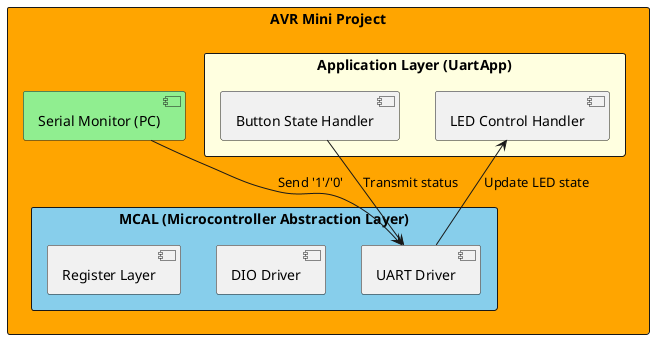
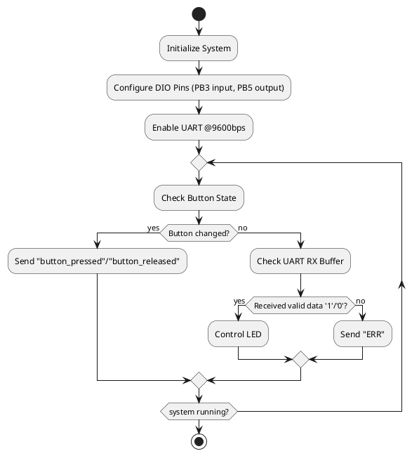
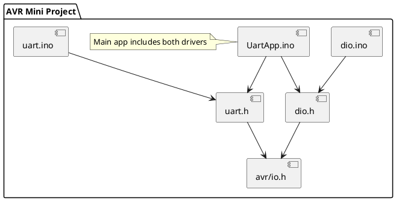

# Detailed Design Document

| **Author**              | `Hana M. Elnady`                                     |
|:------------------------|:-----------------------------------------------------|
| **Version**             | `1.0`                                                |
| **Date**                | `19/10/2025`                                         |

## Introduction
This document provides the detailed design for the **AVR Mini Project** implementing UART communication and Digital I/O (DIO) control on an **ATmega328P** microcontroller.  
The system allows the user to send and receive serial commands via UART to control an LED and to monitor the state of a push button.  
It demonstrates register-level C programming using direct access to MCU registers without Arduino libraries.

### Purpose
The purpose of this design is to describe the low-level implementation of the **UART application layer** and **DIO driver**, clarifying how software and hardware interact to fulfil two use cases:
1. **Input acquisition:** detect and transmit push-button press/release events through UART.  
2. **Output control:** receive UART commands (`'1'`, `'0'`) to control an LED.

### Scope
The design covers all modules developed by the student, including:
- Digital Input/Output module (`dio.ino`)
- UART Application module (`UartApp.ino`)
- UART driver (`uart.ino` / `uart.h`)  
It excludes the higher-level host interface (e.g. PC serial monitor) and power supply circuitry.

## Architectural Overview
This section shows how the UART Application and DIO modules fit into the MCU architecture.

### Assumptions & Constraints
- Microcontroller: ATmega328P (16 MHz clock).
- Programming language: Standard C, compiled with AVR-GCC.
- Environment: Arduino IDE used only as an uploader (no Arduino libraries).
- Button connection: Active-LOW using internal pull-up on PB3 (Arduino D11).
- LED connection: Output on PB5 (Arduino D13, onboard LED).
- Baud rate: 9600 bps.
- No RTOS, simple polling approach.
- Timing constraints are non-critical; latency under 100 ms acceptable.

## Functional Description
#### Use Case 1 – Button Monitoring:
The MCU continuously samples the button input using software debouncing (3 samples × 20 ms).
When a stable transition is detected, it transmits "button_pressed" or "button_released" via UART.

#### Use Case 2 – LED Control:
The MCU listens for UART bytes from the PC:

'1' → LED ON

'0' → LED OFF

For each valid command, "OK" is sent back. Invalid inputs produce "ERR".

Both functions run inside the same infinite loop using non-blocking polling.

## Implementation of the Module
#### dio.ino configures pin directions and implements:
- DIO_Init() – sets LED as output, button as input with pull-up.
- DIO_SetLED(on) – drives LED pin HIGH or LOW.
- DIO_ReadButton() – debounced button read (active LOW → returns 1 when pressed).

#### UartApp.ino provides:
- main() – application entry point.
- Polls both DIO and UART modules.
- Executes command handling and message transmission.

## Integration and Configuration
### Static Files

| File name   | Contents                                                         |
|-------------|------------------------------------------------------------------|
| dio.ino     | Implements digital input/output functions for LED and button.    |
| dio.h       | Macro definitions for port, pin mapping, and prototypes.         |
| uart.ino    | UART driver providing register-level transmit/receive functions. |
| Uart.h      | UART interface declarations.                                     |
| UartApp.ino | Main application combining UART and DIO logic.                   |

### Include Structure

If there is a complex file structure e.g. more than one c-file or more than two h-files use a diagram to explain the relationship between the source and dependent include files.

### Configuration
Any required hardware/software or system configuration that can be adjusted in a header file is detailed below.
| Name          | Value range | Description                                           |
|---------------|-------------|-------------------------------------------------------|
| F_CPU         | 16 MHz      | MCU clock frequency for delay and baud calculations.  |
| BAUD          | 9600 bps    | Serial communication speed.                           |
| LED_PENN      | PB5         | LED output pin (Arduino D13).                         |
| BTN_PINN      | PB3         | Button input pin (Arduino D11).                       |
| DEBOUNCE_MS   | 10-30 ms    | Delay between button samples.                         |
| SAMPLE_COUNT  | 3           | Number of consistent reads for stable state.          |

